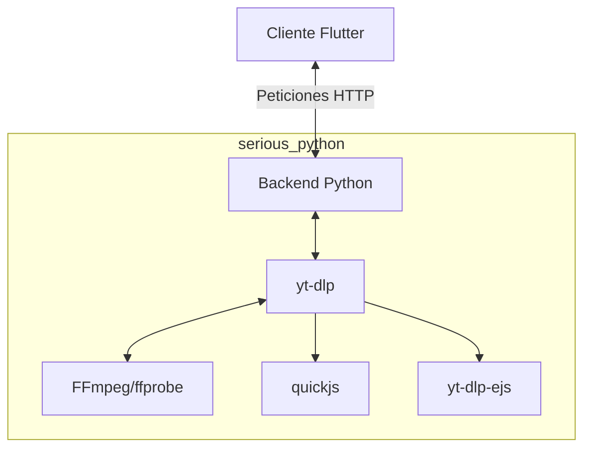

<p align="center">
 
</p>
<h1 align="center">Vidra</h1>

<p align="center">
  Gestor de vídeo/tareas de nivel de escritorio (interfaz de usuario Flutter + backend Python en repositorio separado)
</p>

<p align="center">
 <a href="https://github.com/chomusuke-mk/vidra/releases"></a>
 <a href="docs/system-architecture.md"></a>
 <a href="https://github.com/chomusuke-mk/vidra/issues"></a>
</p>

<p align="center">
 <a href="https://flutter.dev"></a>
 <a href="https://www.python.org/"></a>
 <a href="THIRD_PARTY_LICENSES.md"></a>
 <a href="https://www.buymeacoffee.com/chomusuke"></a>
 <a href="https://www.patreon.com/chomusuke_dev"></a>
</p>

> Vidra es un gestor de vídeo y tareas para escritorio que combina una interfaz de usuario Flutter con un backend Python mantenido en un repositorio separado.

## Aspectos destacados

- **Cliente moderno** – Una aplicación de escritorio Flutter con temas y localización para más de 150 idiomas.
- **Backend robusto y ligero** – Backend Python separado, con dependencias dinámicas para descargas y manejo de cambios mediante deltas.

## Instalación

Vidra se distribuye a través de **GitHub Releases**. Cada versión incluye instaladores para diferentes plataformas.

| Plataforma | Instalador                                                                          |
| ---------- | ----------------------------------------------------------------------------------- |
| `Windows`  | `vidra-windows.exe`                                                                 |
| `Linux`    | `vidra-linux.AppImage` <br>`vidra-linux.deb`                                        |
| `Android`  | `vidra-android.apk`<br> `vidra-android-arm64-v8a.apk`<br>`vidra-android-x86_64.apk` |
| `macOS`    | Próximamente                                                                        |

### Validar Firmas y Checksums

Cada release incluye los siguientes archivos para verificar la integridad y autenticidad de los instaladores:

- `SHA2-256SUMS`, `SHA2-512SUMS`: checksums.
- `SHA2-256SUMS.sig`, `SHA2-512SUMS.sig`: GPG signatures for the checksums.

Estos recursos se distribuyen bajo la licencia [LICENSE](LICENSE) y pueden incluir componentes bajo otras licencias enumeradas en [THIRD_PARTY_LICENSES.md](THIRD_PARTY_LICENSES.md).

## Arquitectura



### FFmpeg / ffprobe ejecutables

Para ejecutar Vidra, debe proporcionar `ffmpeg` y `ffprobe` por su cuenta.

Fuente recomendada: <https://github.com/chomusuke-mk/vidra-ffmpeg>

Coloca los archivos con los nombres **exactos** en las siguientes ubicaciones:

| Plataforma  | Ubicación esperada dentro del proyecto                                                                    |
| ----------- | --------------------------------------------------------------------------------------------------------- |
| **Windows** | `windows/ffmpeg.exe` <br> `windows/ffprobe.exe`                                                           |
| **Linux**   | `linux/ffmpeg` <br> `linux/ffprobe`                                                                       |
| **Android** | `android/app/src/main/jniLibs/<abi>/libffmpeg.so` <br> `android/app/src/main/jniLibs/<abi>/libffprobe.so` |

> - `<abi>` debe ser uno de `arm64-v8a`, o `x86_64`.

### Quickjs ejecutables

Para ejecutar Vidra, debe proporcionar `quickjs` por su cuenta.

Fuente recomendada: <https://github.com/chomusuke-mk/vidra-quickjs>

Coloca los archivos con los nombres **exactos** en las siguientes ubicaciones:

| Plataforma  | Ubicación esperada dentro del proyecto                                                                     |
| ----------- | ---------------------------------------------------------------------------------------------------------- |
| **Windows** | `windows/quickjs.exe` <br> `windows/quickjs.exe`                                                           |
| **Linux**   | `linux/quickjs` <br> `linux/quickjs`                                                                       |
| **Android** | `android/app/src/main/jniLibs/<abi>/libquickjs.so` <br> `android/app/src/main/jniLibs/<abi>/libquickjs.so` |

> - `<abi>` debe ser uno de `arm64-v8a`, o `x86_64`.

## Inicio rápido

### 1. Inicializar el espacio de trabajo de Flutter

```bash
flutter pub get
dart run flutter_launcher_icons # opcional, regenera los iconos
```

### Cliente de escritorio Flutter

```bash
flutter run -d windows
flutter run -d linux
flutter run -d android
```

## Empaquetado y distribución

1. Asegúrate de que el paquete backend dentro de `app/app.zip` esté actualizado:

   ```bash
    dart run serious_python:main package app/src \
    -r -r -r app/requirements.txt \
    -p Windows --verbose \
    --output app/app.zip
   ```

   > El backend se distribuye en <https://github.com/chomusuke-mk/vidra-backend> y este repositorio solo empaqueta la interfaz Flutter junto con los binarios y dependencias que se descargan al ejecutar la aplicación.

2. Copia `app/app.zip` y el hash generado (`app/app.zip.hash`) en la lista de recursos de Flutter (ya declarada en `pubspec.yaml`).

3. Compila el artefacto de destino (`flutter build windows`, `flutter build macos`, etc.).

   > El repositorio incluye tareas de VS Code (`Serious Python: Empaquetar <plataforma> App`, `Compilar APK de Android (Flutter)`) que encapsulan los mismos comandos.

## Localización y recursos

- Las traducciones se encuentran en `i18n/locales/<código ISO>/`. Utilice los scripts auxiliares en `tool/` (por ejemplo, `auto_translate_locales.py`, `generate_translation_progress.py`) para mantener los idiomas sincronizados.
- El directorio `assets/` contiene iconos, animaciones y plantillas `.env`. Todos los recursos referenciados se declaran en `pubspec.yaml`.

## Testing & QA

| Scope                     | Command                                                                     |
| ------------------------- | --------------------------------------------------------------------------- |
| Flutter widget/unit tests | `flutter test`                                                              |
| Integration smoke test    | `flutter test --tags integration` (tests under `test/` and `test/backend/`) |

Use `VIDRA_SERVER_DATA` to point tests at a temporary directory so logs are isolated per run.

## Documentation & troubleshooting

- `docs/system-architecture.md` – end-to-end overview of the Flutter client, backend, sockets, and packaging flow.
- `docs/client-flows.md` – English descriptions of UI flows mapped to REST/WebSocket contracts.
- `docs/typed-architecture.md` – explains the typed model refactor and state layers inside the backend.
- `docs/backend-job-lifecycle.md` – canonical reference for job states, transitions, and related endpoints.
- `docs/configuration-and-ops.md` – environment variables, logging targets, and ops runbooks.
- `docs/troubleshooting.md` – symptom → cause → fix catalog for packaging, sockets, and localization failures.
- `temp/native-crash.txt` – crash dump location; include it with bug reports.
- Structured logs are written to `<VIDRA_SERVER_DATA>/release_logs.txt` automatically at runtime.

## Contributing & security

- Read `CONTRIBUTING.md` for coding standards, branching strategy, and review expectations.
- Vulnerability disclosures go through `SECURITY.md`.
- Please keep `git` history clean and avoid force-pushing to `main`.

## Licensing & attribution

- Project licensing follows the root `LICENSE` file.
- Every third-party dependency (Python + Flutter), incluyendo las descargas dinámicas `yt-dlp` y `yt-dlp-ejs`, is documented in [THIRD_PARTY_LICENSES.md](THIRD_PARTY_LICENSES.md), with verbatim license texts stored under `third_party_licenses/` for inclusion in installers.
- Remember that `mutagen` is GPL-2.0-or-later; distributing Vidra to end users requires shipping the corresponding backend sources to satisfy GPL obligations.
