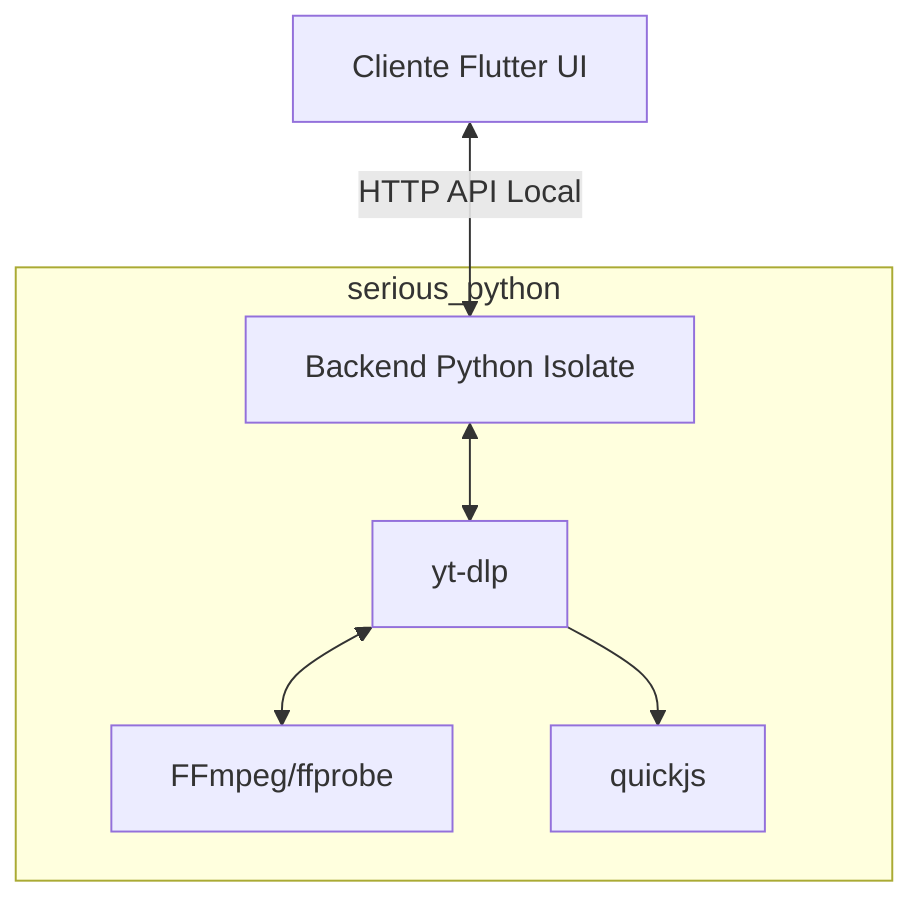

<p align="center">
 
</p>
<h1 align="center">Vidra</h1>

<p align="center">
  Gestor de descargas de vídeo de nivel de escritorio (interfaz en Flutter + backend en Python integrado vía serious_python)
</p>

<p align="center">
 <a href="https://github.com/chomusuke-mk/vidra/releases"></a>
 <a href="docs/system-architecture.md"></a>
 <a href="https://github.com/chomusuke-mk/vidra/issues"></a>
</p>

<p align="center">
 <a href="https://flutter.dev"></a>
 <a href="https://www.python.org/"></a>
 <a href="THIRD_PARTY_LICENSES.md"></a>
 <a href="https://www.buymeacoffee.com/chomusuke"></a>
 <a href="https://www.patreon.com/chomusuke_dev"></a>
</p>

> Vidra es un gestor avanzado de descarga de vídeos para escritorio y dispositivos móviles. Esta segunda versión reconstruida desde cero combina una moderna interfaz de usuario en Flutter con un potente motor de descargas en Python (`yt-dlp`), el cual se integra de forma transparente como un proceso en segundo plano (isolate).

## ✨ Características Destacadas

- **Cliente Moderno y Escalable:** Construido en Flutter bajo los principios de Clean Architecture, con soporte completo para temas (claro/oscuro) e internacionalización.
- **Backend Integrado de Alto Rendimiento:** Utiliza un backend en Python empaquetado directamente en la aplicación a través de `serious_python`.
- **Despliegue Multiplataforma:** CI/CD automatizado mediante GitHub Actions que garantiza la generación de binarios para Android, Windows y Linux.
- **Gestión Avanzada de Descargas:** Comunicación fluida mediante APIs RESTful locales para reflejar el progreso de las descargas en tiempo real, utilizando un puerto seguro y dinámico.

## 📥 Instalación

Vidra se distribuye de manera oficial a través de la sección **GitHub Releases**. Cada versión incluye instaladores y empaquetados específicos para las diferentes plataformas soportadas.

| Plataforma | Archivo / Instalador                                                                                                       |
| ---------- | -------------------------------------------------------------------------------------------------------------------------- |
| **Windows**| `vidra-windows.exe`                                                                                                        |
| **Linux**  | `vidra-x86_64.AppImage` <br>`vidra-linux.deb`                                                                              |
| **Android**| `vidra-android.apk`<br> `vidra-android-arm64-v8a.apk`<br>`vidra-android-x86_64.apk` <br>`vidra-android-armeabi-v7a.apk`    |
| **macOS**  | *Próximamente*                                                                                                             |

### Validación de Firmas y Checksums

Cada lanzamiento incluye archivos para verificar la integridad y autenticidad de los binarios:

- `SHA2-256SUMS`, `SHA2-512SUMS`: Sumas de comprobación.
- `SHA2-256SUMS.sig`, `SHA2-512SUMS.sig`: Firmas GPG de las sumas de comprobación.

Estos recursos se distribuyen bajo la licencia [LICENSE](LICENSE) y pueden contener componentes de terceros bajo diversas licencias. Consulta el archivo [THIRD_PARTY_LICENSES.md](THIRD_PARTY_LICENSES.md) para más detalles.

## 🏗️ Arquitectura General


```mermaid
graph TD
  A[Cliente Flutter UI] <-->|HTTP API Local| B[Backend Python Isolate]
  subgraph serious_python
    B <--> C[yt-dlp]
    C <--> D[FFmpeg/ffprobe]
    C --> E[quickjs]
  end
```

Para detalles exhaustivos, consulta el documento [docs/system-architecture.md](docs/system-architecture.md).

### Dependencias Nativas: FFmpeg y QuickJS

Para el correcto funcionamiento en desarrollo, Vidra requiere ejecutables externos (`ffmpeg`, `ffprobe` y `quickjs`) que son descargados y gestionados automáticamente durante el pipeline de CI/CD (GitHub Actions).

Si compilas la aplicación localmente de forma manual, asegúrate de proveer estos ejecutables en las siguientes rutas según tu sistema operativo:

| Plataforma  | Directorio destino en el proyecto                                                                         |
| ----------- | --------------------------------------------------------------------------------------------------------- |
| **Windows** | `windows/ffmpeg.exe`, `windows/ffprobe.exe`, `windows/quickjs.exe`                                        |
| **Linux**   | `linux/ffmpeg`, `linux/ffprobe`, `linux/quickjs`                                                          |
| **Android** | `android/app/src/main/jniLibs/<abi>/libffmpeg.so`, `libffprobe.so`, `libquickjs.so`                       |

*(Donde `<abi>` puede ser `arm64-v8a`, `x86_64`, o `armeabi-v7a`).*

## 🚀 Inicio Rápido para Desarrollo

### 1. Preparar el entorno de Flutter

```bash
flutter pub get
```

### 2. Configurar el Backend en Python

El backend de Vidra se inyecta utilizando `serious_python`. Para entornos locales:

1. Obtén el código fuente del backend más reciente (generalmente desde el repositorio de backend o como archivo ZIP).
2. Extrae su contenido dentro de `app/src`.
3. Empaqueta la aplicación ejecutando:

```bash
dart run serious_python:main package app/src -r -r -r app/requirements/base.txt -r -r -r app/requirements/Windows.txt -p Windows --verbose
```

*(Cambia `Windows` y `Windows.txt` por tu plataforma destino: `Linux`, `Android`, etc.)*

### 3. Ejecutar el Cliente

Una vez empaquetado el backend, el motor de compilación de Flutter lo integrará automáticamente.

```bash
flutter run -d windows
# o linux, android, etc.
```

## 📦 Flujo de CI/CD (GitHub Actions)

El repositorio incluye un flujo automatizado en `.github/workflows/vidra-release.yml`. Este pipeline se encarga de:

1. Descargar dinámicamente la última versión del código Python (`app.zip` desde el repositorio externo).
2. Descargar las dependencias nativas precompiladas (FFmpeg y QuickJS).
3. Empaquetar todo mediante `serious_python`.
4. Compilar los binarios finales (APK, EXE, AppImage, DEB).
5. Firmar criptográficamente los hashes generados para asegurar la autenticidad del release.

## 🌐 Internacionalización (i18n)

Vidra soporta múltiples idiomas. Los archivos de localización se encuentran preconfigurados para escalar mediante gestores de estado.

## 📚 Documentación Adicional

- [docs/system-architecture.md](docs/system-architecture.md) – Detalle técnico de la arquitectura y la integración cliente-servidor.
- [docs/client-flows.md](docs/client-flows.md) – Ciclo de vida y flujos principales de interfaz de usuario.
- [docs/development-guide.md](docs/development-guide.md) – Guía completa para pruebas, solución de problemas y configuración.

## 🤝 Contribuciones y Seguridad

- Revisa el [CONTRIBUTING.md](.github/CONTRIBUTING.md) para conocer los estándares de código y cómo abrir Pull Requests.
- Consulta el [CODE_OF_CONDUCT.md](.github/CODE_OF_CONDUCT.md) para garantizar un entorno comunitario sano y profesional.
- Para reportar vulnerabilidades, sigue los pasos estipulados en [SECURITY.md](.github/SECURITY.md).

## 📄 Licencia

Este proyecto se distribuye bajo la licencia **[LICENSE](LICENSE)** original (GPLv3).  
Las dependencias de terceros, que incluyen librerías de Flutter, componentes del runtime de Python y herramientas integradas como `yt-dlp`, se encuentran documentadas exhaustivamente en [THIRD_PARTY_LICENSES.md](THIRD_PARTY_LICENSES.md).
