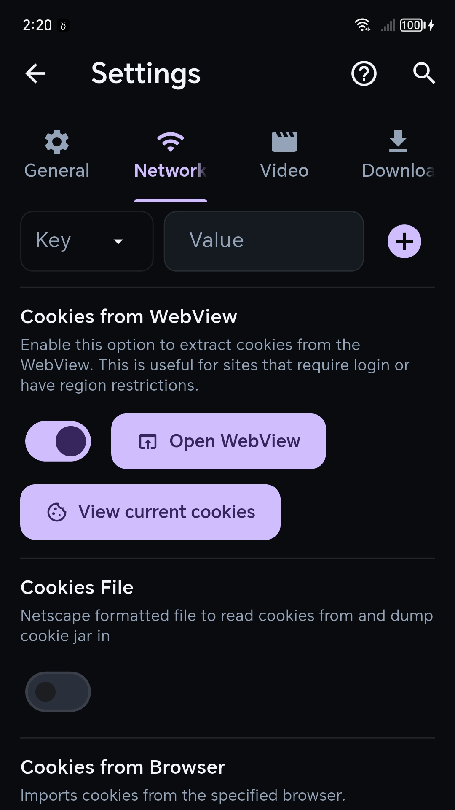
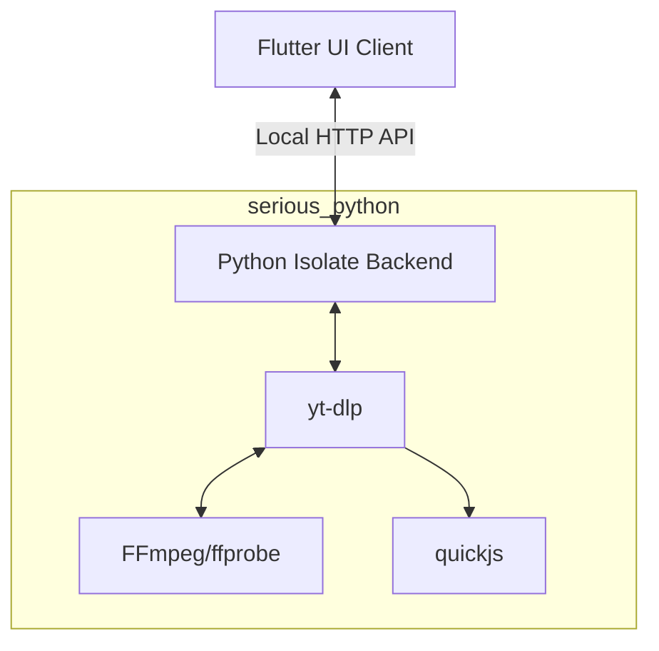

<p align="center">
 
</p>
<h1 align="center">Vidra</h1>

<p align="center">
  Desktop-grade video download manager (Flutter interface + integrated Python backend via serious_python)
</p>

<p align="center">
 <a href="https://github.com/chomusuke-mk/vidra/releases"></a>
 <a href="docs/system-architecture.md"></a>
 <a href="https://github.com/chomusuke-mk/vidra/issues"></a>
</p>

<p align="center">
 <a href="https://flutter.dev"></a>
 <a href="https://www.python.org/"></a>
 <a href="THIRD_PARTY_LICENSES.md"></a>
 <a href="https://www.buymeacoffee.com/chomusuke"></a>
 <a href="https://www.patreon.com/chomusuke_dev"></a>
</p>

> Vidra is an advanced video download manager for desktop and mobile devices. This second version, rebuilt from scratch, combines a modern user interface in Flutter with a powerful Python download engine (`yt-dlp`), seamlessly integrated as a background process (isolate).

## 📸 Screenshots

### Desktop (Linux / Windows)
<p align="center">
  
  
</p>

### Mobile (Android)
<p align="center">
  
  
  
</p>

## ✨ Key Features

- **Modern and Scalable Client:** Built in Flutter under Clean Architecture principles, with full support for themes (light/dark) and internationalization.
- **High-Performance Integrated Backend:** Uses a Python backend packaged directly into the application via `serious_python`.
- **Cross-Platform Deployment:** Automated CI/CD using GitHub Actions ensuring the generation of binaries for Android, Windows, and Linux.
- **Advanced Download Management:** Seamless communication via local RESTful APIs to reflect download progress in real-time, using a secure and dynamic port.

## 📥 Installation

Vidra is officially distributed through the **[GitHub Releases (Latest Assets)](https://github.com/chomusuke-mk/vidra/releases/latest)** section. Each release includes specific installers and packages for the different supported platforms.

| Platform    | File / Installer                                                                                                        |
| ----------- | ----------------------------------------------------------------------------------------------------------------------- |
| **Windows** | `vidra-windows.exe`                                                                                                     |
| **Linux**   | `vidra-x86_64.AppImage` <br>`vidra-linux.deb`                                                                           |
| **Android** | `vidra-android.apk`<br> `vidra-android-arm64-v8a.apk`<br>`vidra-android-x86_64.apk` <br>`vidra-android-armeabi-v7a.apk` |
| **macOS**   | _Coming soon_                                                                                                           |

### 📱 F-Droid Repository

Vidra is also available through our official **F-Droid Repository**. To install the app and receive automatic background updates, add the repository directly to your F-Droid client (or compatible alternatives like Droid-ify/Neo Store):

- **Repository URL:** `https://fdroid.chomusuke.dev/repo`

### 🐧 Other Directories & Stores

Vidra is also published and available on the following platforms:

- **OpenDesktop:** [http://opendesktop.org/p/2367692](http://opendesktop.org/p/2367692)
- **Snapcraft:** [https://snapcraft.io/vidra](https://snapcraft.io/vidra)
- **AppImageHub:** [https://appimage.github.io/Vidra/](https://appimage.github.io/Vidra/)

### APT Repository (Debian/Ubuntu)

For Linux users on Debian or Ubuntu-based distributions, Vidra can be installed and kept up-to-date automatically using our official APT repository.

Run the following commands in your terminal:

```bash
# 1. Download the public security key
wget -qO- https://apt.chomusuke.dev/public.key | sudo tee /etc/apt/keyrings/chomusuke.asc > /dev/null

# 2. Add the repository to your sources list
echo "deb [signed-by=/etc/apt/keyrings/chomusuke.asc] https://apt.chomusuke.dev/ stable main" | sudo tee /etc/apt/sources.list.d/chomusuke.list

# 3. Update and install the app
sudo apt update
sudo apt install vidra
```

### Signature Validation and Checksums

Each release includes files to verify the integrity and authenticity of the binaries:

- `SHA2-256SUMS`, `SHA2-512SUMS`: Checksums.
- `SHA2-256SUMS.sig`, `SHA2-512SUMS.sig`: GPG signatures of the checksums.

These resources are distributed under the [LICENSE](LICENSE) and may contain third-party components under various licenses. Check the [THIRD_PARTY_LICENSES.md](THIRD_PARTY_LICENSES.md) file for more details.

## 🏗️ General Architecture


```mermaid
graph TD
  A[Flutter UI Client] <-->|Local HTTP API| B[Python Isolate Backend]
  subgraph serious_python
    B <--> C[yt-dlp]
    C <--> D[FFmpeg/ffprobe]
    C --> E[quickjs]
  end
```

For exhaustive details, check the [docs/system-architecture.md](docs/system-architecture.md) document.

### Native Dependencies: FFmpeg and QuickJS

For proper development functionality, Vidra requires external executables (`ffmpeg`, `ffprobe`, and `quickjs`) that are automatically downloaded and managed during the CI/CD pipeline (GitHub Actions).

If you compile the application locally manually, make sure to provide these executables in the following paths depending on your operating system:

| Platform    | Target directory in the project                                                     |
| ----------- | ----------------------------------------------------------------------------------- |
| **Windows** | `windows/ffmpeg.exe`, `windows/ffprobe.exe`, `windows/quickjs.exe`                  |
| **Linux**   | `linux/ffmpeg`, `linux/ffprobe`, `linux/quickjs`                                    |
| **Android** | `android/app/src/main/jniLibs/<abi>/libffmpeg.so`, `libffprobe.so`, `libquickjs.so` |

_(Where `<abi>` can be `arm64-v8a`, `x86_64`, or `armeabi-v7a`)._

## 🚀 Quick Start for Development

### 1. Prepare the Flutter environment

```bash
flutter pub get
```

### 2. Configure the Python Backend

Vidra's backend is injected using `serious_python`. For local environments:

1. Get the latest backend source code (usually from the backend repository or as a ZIP file).
2. Extract its contents inside `app/src`.
3. Package the application by running:

```bash
dart run serious_python:main package app/src -r -r -r app/requirements/base.txt -r -r -r app/requirements/Windows.txt -p Windows --verbose
```

_(Change `Windows` and `Windows.txt` to your target platform: `Linux`, `Android`, etc.)_

### 3. Run the Client

Once the backend is packaged, the Flutter build engine will integrate it automatically.

```bash
flutter run -d windows
# or linux, android, etc.
```

## 📦 CI/CD Flow (GitHub Actions)

The repository includes an automated flow in `.github/workflows/vidra-release.yml`. This pipeline handles:

1. Dynamically downloading the latest Python code version (`app.zip` from the external repository).
2. Downloading pre-compiled native dependencies (FFmpeg and QuickJS).
3. Packaging everything via `serious_python`.
4. Compiling the final binaries (APK, EXE, AppImage, DEB).
5. Cryptographically signing the generated hashes to ensure release authenticity.

## 🌐 Internationalization (i18n)

Vidra supports multiple languages. Localization files are pre-configured to scale using state managers.

## 📚 Additional Documentation

- [docs/system-architecture.md](docs/system-architecture.md) – Technical details of the architecture and client-server integration.
- [docs/client-flows.md](docs/client-flows.md) – Lifecycle and main user interface flows.
- [docs/development-guide.md](docs/development-guide.md) – Comprehensive guide for testing, troubleshooting, and configuration.

## 🤝 Contributions and Security

- Check the [CONTRIBUTING.md](.github/CONTRIBUTING.md) to know the coding standards and how to open Pull Requests.
- Check the [CODE_OF_CONDUCT.md](.github/CODE_OF_CONDUCT.md) to ensure a healthy and professional community environment.
- To report vulnerabilities, follow the steps outlined in [SECURITY.md](.github/SECURITY.md).

## 📄 License

This project is distributed under the original **[LICENSE](LICENSE)** (GPLv3).  
Third-party dependencies, which include Flutter libraries, Python runtime components, and integrated tools like `yt-dlp`, are exhaustively documented in [THIRD_PARTY_LICENSES.md](THIRD_PARTY_LICENSES.md).
