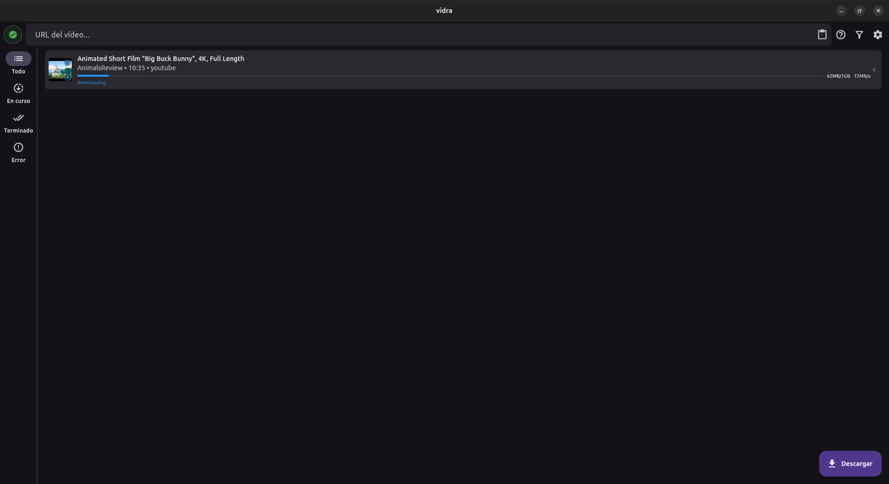
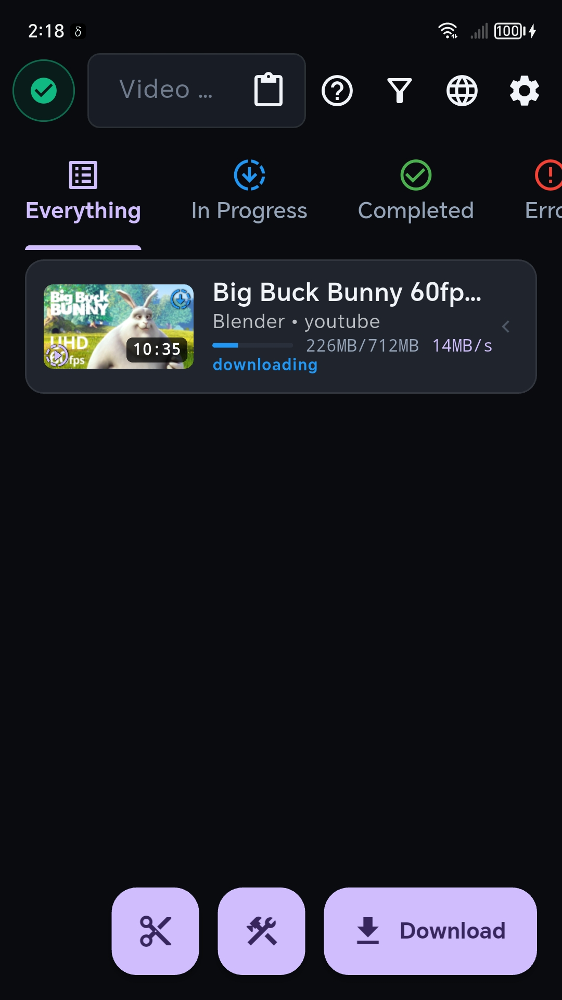
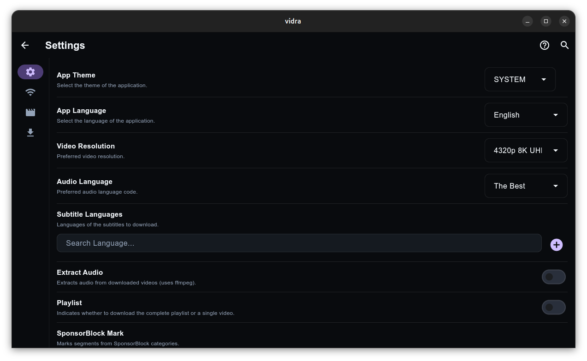
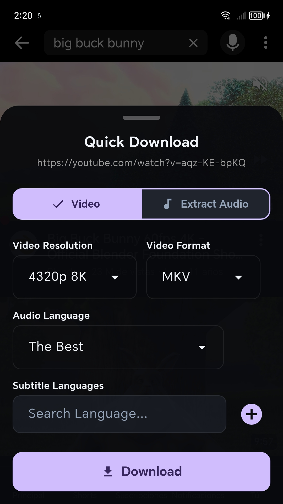
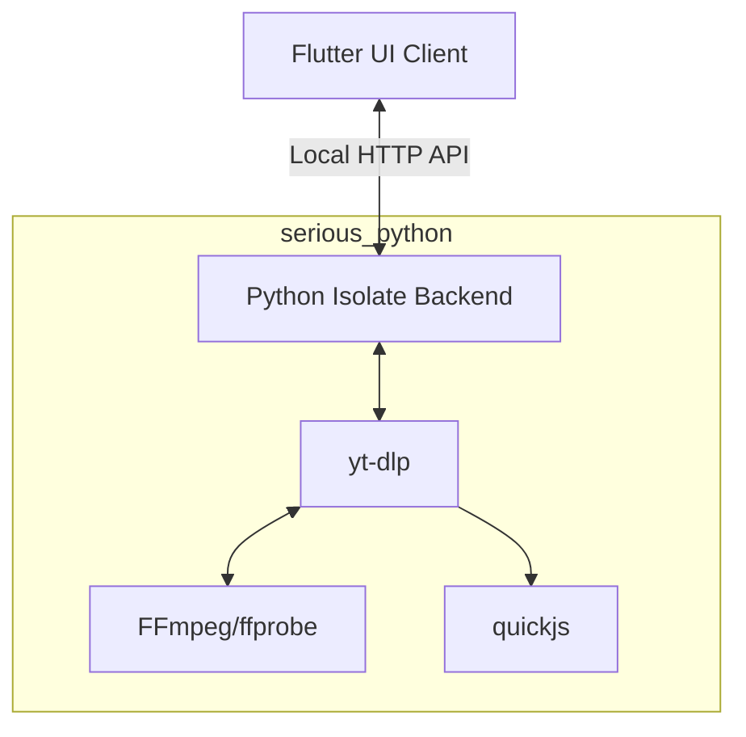

<p align="center">
 
</p>
<h1 align="center">Vidra</h1>

<p align="center">
  Desktop-grade video download manager (Flutter interface + integrated Python backend via serious_python)
</p>

<p align="center">
 <a href="https://github.com/chomusuke-mk/vidra/actions/workflows/vidra-release.yml" target="_blank"></a>
 <a href="docs/system-architecture.md" target="_blank"></a>
 <a href="https://github.com/chomusuke-mk/vidra/issues" target="_blank"></a>
</p>

<p align="center">
 <a href="https://flutter.dev"></a>
 <a href="https://www.python.org/"></a>
 <a href="LICENSE"></a>
 <a href="https://www.buymeacoffee.com/chomusuke"></a>
 <a href="https://www.patreon.com/chomusuke_dev"></a>
</p>

<p align="center">
  <a href="https://github.com/chomusuke-mk/vidra/releases/latest"></a>
  <a href="https://fdroid.chomusuke.dev"></a>
  <a href="https://apps.obtainium.imranr.dev/redirect?r=obtainium://add/https://github.com/chomusuke-mk/vidra"></a>
  <a href="https://community.chocolatey.org/packages/vidra"></a>
  <a href="https://snapcraft.io/vidra"></a>
  <a href="http://opendesktop.org/p/2367692"></a>
  <a href="https://appimage.github.io/Vidra/"></a>
</p>

> **The uncompromised power of yt-dlp, accessible to everyone.**  
> While other mobile and desktop projects rely on limited wrapper packages or imitations that restrict functionality, Vidra embeds the **original** `yt-dlp` engine. This brings its complete, raw feature set and advanced configuration capabilities directly to Android, Windows, and Linux—all wrapped in a beautifully designed, user-friendly interface.

## 📖 Table of Contents

- [📖 Table of Contents](#-table-of-contents)
- [✨ Key Features \& Insights](#-key-features--insights)
- [📸 Screenshots](#-screenshots)
- [📥 Installation](#-installation)
- [⚠️ Disclaimer](#️-disclaimer)
- [🏗️ General Architecture](#️-general-architecture)
- [🚀 Quick Start for Development](#-quick-start-for-development)
- [🌐 Internationalization (i18n)](#-internationalization-i18n)
- [📚 Additional Documentation](#-additional-documentation)
- [🤝 Contributions and Security](#-contributions-and-security)
- [📄 License](#-license)

---

## ✨ Key Features & Insights

- 🔄 **Always Up-to-Date (OTA):** Built-in Over-The-Air updates ensure your core engines (`yt-dlp` and `yt-dlp-ejs`, including beta channels) are always running the latest versions, fetched directly from their official repositories.
- 🛡️ **Zero Telemetry:** Vidra is completely offline-first and private. It collects absolutely no personal data, telemetry, or usage metrics.
- 🔐 **Cryptographically Verified:** All binaries and OTA updates are downloaded from official sources and strictly verified using cryptographic signatures for maximum security.
- 🎨 **Modern and Scalable Client:** Built in Flutter under Clean Architecture principles, with full support for themes (light/dark) and internationalization.
- ⚙️ **High-Performance Integrated Backend:** Seamless communication via local RESTful APIs to reflect download progress in real-time using a Python isolate backend.

---

## 📸 Screenshots

|                                       Linux / Windows                                        |                                                  Mobile (Android)                                                   |
| :------------------------------------------------------------------------------------------: | :-----------------------------------------------------------------------------------------------------------------: |
|  |  |
|  |  |

---

## 📥 Installation

Vidra is officially distributed through the **[GitHub Releases (Latest Assets)](https://github.com/chomusuke-mk/vidra/releases/latest)** section.

| Platform    | File / Installer                                                                                                                                                                                                                                                                                                                                                                                                                                                                                     |
| ----------- | ---------------------------------------------------------------------------------------------------------------------------------------------------------------------------------------------------------------------------------------------------------------------------------------------------------------------------------------------------------------------------------------------------------------------------------------------------------------------------------------------------- |
| **Windows** | [`vidra-windows.exe`](https://github.com/chomusuke-mk/vidra/releases/latest/download/vidra-windows.exe)                                                                                                                                                                                                                                                                                                                                                                                              |
| **Linux**   | [`vidra-x86_64.AppImage`](https://github.com/chomusuke-mk/vidra/releases/latest/download/vidra-x86_64.AppImage) <br>[`vidra-linux.deb`](https://github.com/chomusuke-mk/vidra/releases/latest/download/vidra-linux.deb)                                                                                                                                                                                                                                                                              |
| **Android** | [`vidra-android.apk`](https://github.com/chomusuke-mk/vidra/releases/latest/download/vidra-android.apk)<br> [`vidra-android-arm64-v8a.apk`](https://github.com/chomusuke-mk/vidra/releases/latest/download/vidra-android-arm64-v8a.apk)<br>[`vidra-android-x86_64.apk`](https://github.com/chomusuke-mk/vidra/releases/latest/download/vidra-android-x86_64.apk) <br>[`vidra-android-armeabi-v7a.apk`](https://github.com/chomusuke-mk/vidra/releases/latest/download/vidra-android-armeabi-v7a.apk) |
| **macOS**   | _Coming soon_                                                                                                                                                                                                                                                                                                                                                                                                                                                                                        |

<details>
<summary><b>🐧 Install via APT Repository (Debian/Ubuntu)</b></summary>

For Linux users on Debian or Ubuntu-based distributions, Vidra can be installed and kept up-to-date automatically using our official APT repository. Run the following commands in your terminal:

```bash
# 1. Download the public security key
wget -qO- https://apt.chomusuke.dev/public.key | sudo tee /etc/apt/keyrings/chomusuke.asc > /dev/null

# 2. Add the repository to your sources list
echo "deb [signed-by=/etc/apt/keyrings/chomusuke.asc] https://apt.chomusuke.dev/ stable main" | sudo tee /etc/apt/sources.list.d/chomusuke.list

# 3. Update and install the app
sudo apt update
sudo apt install vidra
```

</details>

<details>
<summary><b>🔐 Signature Validation and Checksums</b></summary>

Each release includes files to verify the integrity and authenticity of the binaries:

- `SHA2-256SUMS`, `SHA2-512SUMS`: Checksums.
- `SHA2-256SUMS.sig`, `SHA2-512SUMS.sig`: GPG signatures of the checksums.
</details>

---

## ⚠️ Disclaimer

> [!WARNING]
> Vidra is a powerful tool designed to download media for offline use and archiving. Users are solely responsible for their actions and must ensure they have the legal right or permission to download the content. The developers do not endorse, promote, or support copyright infringement.

---

## 🏗️ General Architecture


```mermaid
graph TD
  A[Flutter UI Client] <-->|Local HTTP API| B[Python Isolate Backend]
  subgraph serious_python
    B <--> C[yt-dlp]
    C <--> D[FFmpeg/ffprobe]
    C --> E[quickjs]
  end
```

For exhaustive details, check the [docs/system-architecture.md](docs/system-architecture.md) document.

---

## 🚀 Quick Start for Development

> [!NOTE]
> To build Vidra locally, you will need to package the [Python backend](https://github.com/chomusuke-mk/vidra-backend) and provide the native dependencies: [FFmpeg](https://github.com/chomusuke-mk/vidra-ffmpeg) and [QuickJS](https://github.com/chomusuke-mk/vidra-quickjs).

📖 **Please refer to our [Comprehensive Development Guide](docs/development-guide.md) for full compilation steps, testing strategies, and CI/CD documentation.**

---

## 🌐 Internationalization (i18n)

Vidra supports multiple languages. Localization files are pre-configured to scale using state managers.

---

## 📚 Additional Documentation

- [docs/system-architecture.md](docs/system-architecture.md) – Technical details of the architecture and client-server integration.
- [docs/client-flows.md](docs/client-flows.md) – Lifecycle and main user interface flows.
- [docs/development-guide.md](docs/development-guide.md) – Comprehensive guide for testing, troubleshooting, and configuration.

---

## 🤝 Contributions and Security

- Check the [CONTRIBUTING.md](.github/CONTRIBUTING.md) to know the coding standards and how to open Pull Requests.
- Check the [CODE_OF_CONDUCT.md](.github/CODE_OF_CONDUCT.md) to ensure a healthy and professional community environment.
- To report vulnerabilities, follow the steps outlined in [SECURITY.md](.github/SECURITY.md).

---

## 📄 License

This project is distributed under the original **[LICENSE](LICENSE)** (GPLv3).  
Third-party dependencies, which include Flutter libraries, Python runtime components, and integrated tools like `yt-dlp`, are exhaustively documented in [THIRD_PARTY_LICENSES.md](THIRD_PARTY_LICENSES.md).
