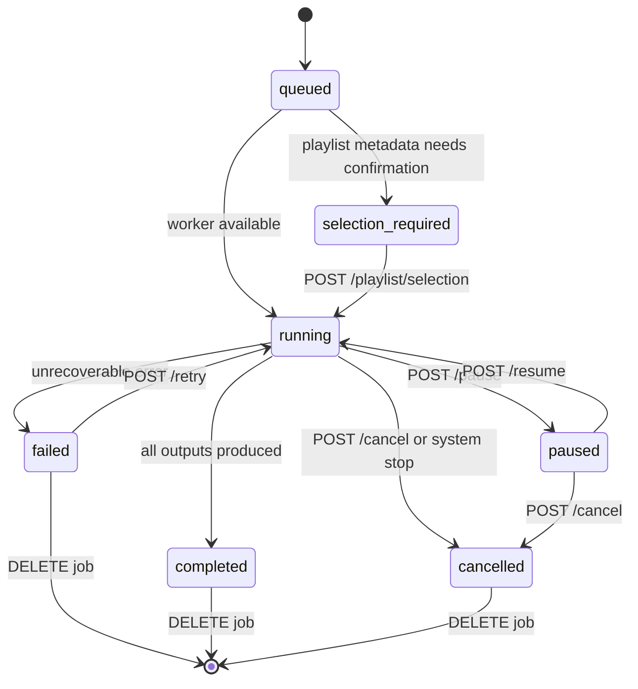

# Backend Job Lifecycle

**Who:** Backend contributors, QA automation, and support engineers.
**Why:** Provide a canonical reference for Vidra job states, transitions, and the REST/WebSocket payloads that drive them.

## State machine

Job state is captured in `DownloadJobState` and persisted via `DownloadJobSnapshot`. Every transition emits both a REST response (when triggered via an endpoint) and a socket event (`JobStatusEvent`).

## Transition table

| From                 | To                   | Trigger                                | REST endpoint                            | Socket event                                     |
| -------------------- | -------------------- | -------------------------------------- | ---------------------------------------- | ------------------------------------------------ |
| `[new]`              | `queued`             | `POST /api/jobs`                       | `POST /api/jobs`                         | `status:queued`                                  |
| `queued`             | `running`            | Worker picks job                       | Implicit                                 | `status:running`, `progress` resets              |
| `queued`             | `selection_required` | Playlist metadata requires user choice | Implicit                                 | `playlist.summary`, `status:selection_required`  |
| `selection_required` | `running`            | User confirms entries                  | `POST /api/jobs/{id}/playlist/selection` | `status:running`, `playlist.selection.confirmed` |
| `running`            | `paused`             | User pause                             | `POST /api/jobs/{id}/pause`              | `status:paused`                                  |
| `paused`             | `running`            | User resume                            | `POST /api/jobs/{id}/resume`             | `status:running`, progress resumes               |
| `running`            | `failed`             | yt-dlp error / hook failure            | Implicit                                 | `status:failed`, `log:error`                     |
| `running`            | `completed`          | All tasks succeed                      | Implicit                                 | `status:completed`, `progress:100`               |
| `running`            | `cancelled`          | User cancel / backend shutdown         | `POST /api/jobs/{id}/cancel`             | `status:cancelled`                               |
| `failed`             | `running`            | Retry                                  | `POST /api/jobs/{id}/retry`              | `status:running` (new attempt counter)           |
| `failed`             | `[deleted]`          | Delete job                             | `DELETE /api/jobs/{id}`                  | Socket closed                                    |
| `completed`          | `[deleted]`          | Delete job                             | `DELETE /api/jobs/{id}`                  | Socket closed                                    |
| `cancelled`          | `[deleted]`          | Delete job                             | `DELETE /api/jobs/{id}`                  | Socket closed                                    |

## Persisted snapshots

Persisted state tracks:

- `metadata`: `JobMetadata` (ID, type, URL, owner, timestamps).
- `state`: current enum value plus reason fields (`failure_reason`, `cancel_reason`).
- `progress`: `ProgressSnapshot` with bytes, percentage, eta.
- `playlist`: `PlaylistState` with entries, selection, resume cursors.
- `outputs`: generated files and hook artifacts.
- `attempt`: retry counter, used for exponential backoff.

State is persisted to `<VIDRA_SERVER_DATA>/download_state.json`. When the backend restarts:

1. All snapshots are loaded.
2. Jobs that were `running`/`queued`/`starting` at the time of shutdown are normalized (typically marked as `failed` with a restart reason).
3. Jobs waiting for playlist selection are restored into a `starting`/"waiting selection" state.

## Socket payloads

Every WebSocket message includes:

- `job_id`
- `event` (e.g., `status`, `progress`, `playlist.entry`, `log`)
- `payload` (typed DTOs from `app/src/models/socket/`)
- `ts` (ISO timestamp)

Clients should treat sockets as authoritative; REST endpoints are used for bootstrapping or random access.

## Hooks and side effects

- **Pre-download hooks** can veto a job (transitioning to `failed` immediately) by raising `HookAbortError`.
- **Postprocessor hooks** emit `log` events and may append outputs; failures transition the job to `failed` unless configured as `best_effort`.
- **Post-hook callbacks** run after completion and emit log/socket payloads.

## See also

- `docs/typed-architecture.md` for the dataclasses mentioned above.
- `docs/configuration-and-ops.md` for environment variables and runtime expectations.
- `docs/troubleshooting.md` for interpreting failure reasons and log fields.
