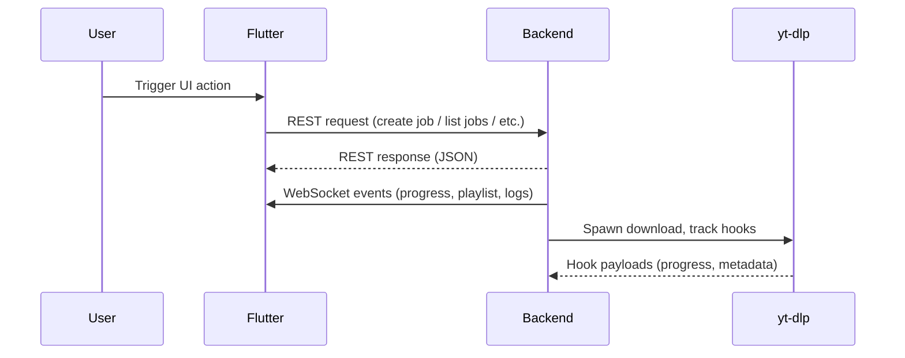

# Client Flows Guide

**Who:** Flutter engineers, QA, and support engineers.
**Why:** Document how each major UI workflow maps to backend APIs, sockets, and cached state so the client can be debugged or extended safely.

The Flutter shell is a desktop-first experience that interacts with the embedded FastAPI backend through REST calls for commands and per-job WebSockets for streaming updates. Use this guide when diagnosing UI regressions, writing new widgets, or validating that QA scenarios touch the right endpoints.

## High-level flow

## UI flows and API contracts

| #   | Flow                                    | UI entry point                | REST endpoints                                                  | WebSocket / notes                                                                    |
| --- | --------------------------------------- | ----------------------------- | --------------------------------------------------------------- | ------------------------------------------------------------------------------------ |
| 1   | Service availability check              | Splash → home boot            | `GET /` (health), `GET /api/jobs?summary=1`                     | `connect /ws/jobs` per job as soon as IDs exist                                      |
| 2   | Single video download                   | "New job" dialog              | `POST /api/jobs` with payload `{type:"video", url}`             | Job-specific socket pushes `progress`, `log`, `status` events                        |
| 3   | Playlist download w/ deferred selection | Same dialog with playlist URL | `POST /api/jobs` (backend sets `selection_required=true`)       | Socket emits `playlist.summary` during metadata scan, UI waits for selection         |
| 4   | Pre-create metadata preview             | Metadata preview panel        | `POST /api/preview` (feature flag `VIDRA_ENABLE_PREVIEW_API`)   | No socket; response already contains thumbnails/timing                               |
| 5   | yt-dlp dry-run                          | Advanced tab                  | `POST /api/jobs/dry-run`                                        | Response includes CLI arguments, no sockets                                          |
| 6   | List current queue                      | Home list                     | `GET /api/jobs` optionally filtered (`status`, `owner`)         | UI subscribes to sockets for each listed job to keep cards live                      |
| 7   | Job detail drill-down                   | Job card → detail screen      | `GET /api/jobs/{jobId}`                                         | Socket stream includes `progress`, `log`, `playlist.entries`, `status`               |
| 8   | Playlist inspection                     | Detail → playlist tab         | `GET /api/jobs/{jobId}/playlist` and `/playlist/items?cursor=`  | Socket emits incremental `playlist.entry` updates when metadata arrives              |
| 9   | Playlist selection confirmation         | Selection dialog              | `POST /api/jobs/{jobId}/playlist/selection`                     | Upon success backend emits `status:running` to resume download                       |
| 10  | Cancel job                              | Detail screen or list action  | `POST /api/jobs/{jobId}/cancel` or `POST /api/jobs/cancel`      | Socket broadcasts `status:cancelled`; UI clears progress                             |
| 11  | Pause/resume                            | Detail toolbar                | `POST /api/jobs/{jobId}/pause`, `POST /api/jobs/{jobId}/resume` | Socket toggles `status:paused` / `status:running`                                    |
| 12  | Retry failed job                        | Snackbar/action menu          | `POST /api/jobs/{jobId}/retry`                                  | New socket session spins up because job ID stays constant but run counter increments |
| 13  | Delete job                              | List overflow menu            | `DELETE /api/jobs/{jobId}`                                      | Socket disconnect for job; UI drops card and clears cache                            |
| 14  | Logs viewer                             | Detail → logs tab             | `GET /api/jobs/{jobId}/logs?cursor=`                            | Socket mirrors realtime log lines tagged with `level`, `source`, `ts`                |
| 15  | Playlist export                         | Playlist tab action           | `GET /api/jobs/{jobId}/playlist?include=entries`                | UI stays offline-capable; caches JSON for re-open                                    |
| 16  | Profiles catalogue (future)             | Settings → profiles           | `GET /api/profiles`                                             | TBD socket support once feature ships                                                |

## Real-time updates

- Each job card opens a dedicated WebSocket channel (`/ws/jobs/{jobId}`). Messages follow the DTOs defined in `app/src/types/socket.py` (`JobProgressEvent`, `PlaylistUpdateEvent`, `LogEvent`).
- Connection lifecycle: subscribe when the card becomes visible; dispose when the user leaves the screen to avoid handle leaks.
- Reconnection policy: exponential backoff with jitter (initial 1s, cap 15s). Pending mutations (pause/cancel) are optimistic and reverted if the socket confirms a conflicting state.

## Caching & offline mode

- `/api/jobs` list responses are persisted via `state/jobs_cache.dart` so the UI can reconstruct the queue after a restart. Entries expire after 15 minutes or when the socket signals a terminal status.
- Playlist entries and logs use paged REST calls; they are cached per job ID on disk (see `data/playlist_cache.dart`). When offline, the UI renders the cached entry list and labels it `STALE`.
- Feature flags impacting client behavior (preview API, download socket toggle) are read from `/api/config` at startup. The result is memoized in `state/server_capabilities.dart`.

## Error handling patterns

- REST failures bubble through `VidraApiException`. UI surfaces toast/snackbar with error code and log link. For 5xx errors, users can open release logs via the app menu.
- Socket disconnects trigger a banner in the detail view. If the backend returns `job_not_found`, the UI assumes the job was deleted elsewhere and removes it from the list.
- Playlist selection conflicts (HTTP 409) happen when a different client already confirmed the selection; the UI forces a refresh and shows the latest selection snapshot.

## See also

- `docs/system-architecture.md` for end-to-end diagrams referencing the same flows.
- `docs/backend-job-lifecycle.md` for the state machine tied to these actions.
- `docs/client-architecture.md` for state management, caching, and widget layout details.
