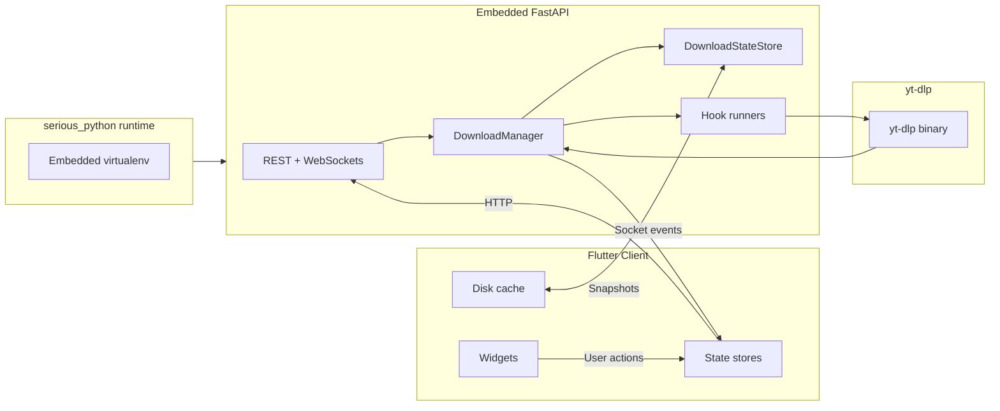
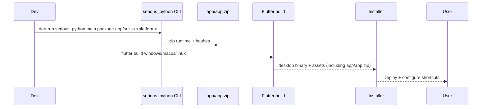

# System Architecture

**Who:** Engineers working across Flutter, Python, and packaging layers.
**Why:** Understand how Vidra stitches together the Flutter desktop client, embedded FastAPI backend, yt-dlp workers, sockets, and packaging pipeline so changes remain coherent.

## Components at a glance

| Layer            | Location                       | Responsibilities                                | Notes                                                                 |
| ---------------- | ------------------------------ | ----------------------------------------------- | --------------------------------------------------------------------- |
| Flutter client   | `lib/`                         | UI, state management, caching, localization     | Uses `provider`, `freezed`, and `serious_python` platform channel.    |
| Embedded backend | `app/src/`                     | REST + WebSocket API, job orchestration, hooks  | FastAPI + Uvicorn + yt-dlp. Uses typed models under `app/src/types/`. |
| Packaging bundle | `app/app.zip`                  | Distributable Python environment                | Built via `serious_python`. Extracted on first run.                   |
| Native shell     | `windows/`, `macos/`, `linux/` | Platform embedding for Flutter                  | Launch script sets env vars (`VIDRA_SERVER_DATA`, etc.).              |
| Ops tooling      | `tool/`, `docs/`, `scripts`    | Localization, translation, packaging automation | Scripts are Python or Dart CLIs.                                      |

## Runtime flow

### Cold-start sequence

1. Flutter launcher unzips `app/app.zip` (if necessary) to `%LOCALAPPDATA%/Vidra` via the `serious_python` plugin.
2. Plugin spawns the Python entrypoint (`app/src/main.py`) with environment variables declared in `lib/config/runtime_config.dart`.
3. FastAPI boots, loads persisted job snapshots, and opens a control socket for per-job updates.
4. Flutter UI renders splash, pings `GET /` and `GET /api/jobs?summary=1` to warm caches.
5. Once healthy, widgets transition to the queue view and subscribe to sockets per job.

### Steady-state interactions

- **Commands:** UI invokes REST endpoints (`POST /api/jobs`, `POST /api/jobs/{id}/pause`, etc.). These map to typed request models and feed the `DownloadManager`.
- **Streaming updates:** Each job exposes a dedicated WebSocket that emits `JobProgressEvent`, `PlaylistUpdateEvent`, and `LogEvent` objects.
- **Persistence:** `DownloadStateStore` writes JSON snapshots (`DownloadJobSnapshot`) to disk. On restart, the backend rehydrates state before reopening sockets.
- **Hooks and automation:** Download/postprocessor hooks configured under `app/json/*.jsonc` fire as yt-dlp emits events. Hooks log structured output and can launch shell commands.

### Packaging pipeline overview

Key artifacts:

- `app/app.zip` and `app/app.zip.hash`: embedded backend bundle.
- Flutter assets manifest (`pubspec.yaml`) lists the bundle and ensures it ships with every build.
- Windows installer (Inno Setup, `installer.iss`) copies third-party licenses from `third_party_licenses/`.

## Dependencies between domains

| Dependency                     | Direction             | Reason                                                |
| ------------------------------ | --------------------- | ----------------------------------------------------- |
| Flutter → FastAPI              | REST, sockets         | Command/control plane.                                |
| FastAPI → yt-dlp               | CLI invocation        | Actual downloads and metadata extraction.             |
| FastAPI ↔ Hooks                | JSON config           | Extensibility for notifications, post-processing.     |
| Flutter ↔ Localization scripts | JSON exports          | Ensure UI strings stay in sync with translation data. |
| Packaging → Ops docs           | Build reproducibility | Release engineers rely on docs to package correctly.  |

## Failure domains & mitigation

- **Backend crash**: Flutter detects socket drop + failed health check, surfaces restart CTA. Logs under `<VIDRA_SERVER_DATA>/release_logs.txt`.
- **Bundle mismatch**: `serious_python` validates `app/app.zip.hash`. Rebuild via VS Code task if hash mismatch occurs.
- **Socket churn**: Client throttles reconnect attempts and falls back to polling `GET /api/jobs/{id}` if sockets fail repeatedly.
- **yt-dlp schema drift**: `ytdlp_adapter` is the only module allowed to touch untyped payloads; all downstream code relies on typed dataclasses.

## See also

- `docs/client-architecture.md` for Flutter-specific layout and state patterns.
- `docs/backend-job-lifecycle.md` for the detailed state machine powering the manager.
- `docs/packaging-and-release.md` for exact commands, VS Code tasks, and signing steps.
