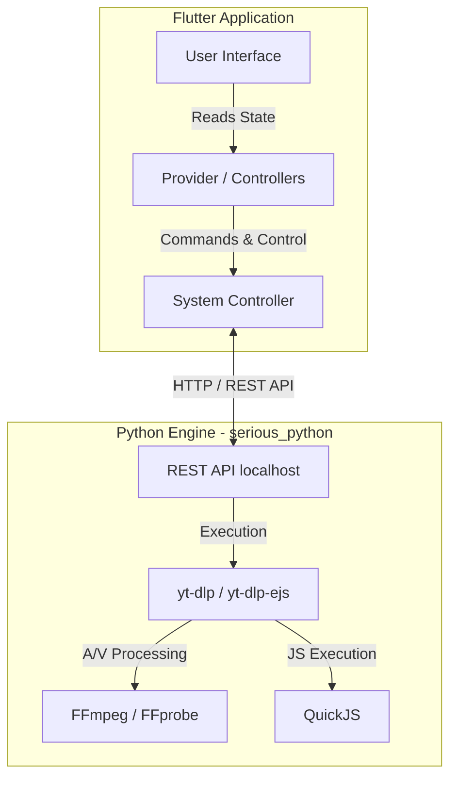

# Vidra System Architecture

This document describes the overall architecture of the Vidra system. In its version 2, Vidra was rebuilt from scratch to adopt a decoupled model where the user interface and the heavy download logic operate in separate processes or layers, ensuring optimal performance and easier maintenance.

## Overview

Vidra is primarily composed of two main blocks:

1. **Frontend Client (Flutter):** Manages the UI, user configuration, localization, themes, and acts as the orchestrator of the backend lifecycle.
2. **Backend Engine (Python):** Runs in the background as a REST server encapsulated within an `Isolate`. It utilizes powerful command-line tools like `yt-dlp` and `ffmpeg` to process downloads.

```mermaid
graph TD
  subgraph Frontend [Flutter Application]
    UI[User Interface]
    State[Provider / Controllers]
    SysCtrl[System Controller]
  end

  subgraph Backend [Python Engine - serious_python]
    Server[REST API localhost]
    YTDLP[yt-dlp / yt-dlp-ejs]
    FFMPEG[FFmpeg / FFprobe]
    QJS[QuickJS]
  end

  UI -->|Reads State| State
  State -->|Commands & Control| SysCtrl
  SysCtrl <-->|HTTP / REST API| Server
  Server -->|Execution| YTDLP
  YTDLP -->|A/V Processing| FFMPEG
  YTDLP -->|JS Execution| QJS
```

## Flutter Client Architecture (lib/)

The Flutter application is structured following **Clean Architecture** principles to achieve a clear separation of responsibilities. Dependency injection and state management are handled via **Provider**.

The folder structure in `lib/` is as follows:

- `core/`: Essential configuration, network clients, utilities, themes, and infrastructure (e.g., `VidraHttpClient`).
- `features/`: Business features organized by domain. Each feature includes logical layers (`data/`, `presentation/`, `domain/`):
  - `downloads/`: Downloads screen, queuing, and the overlay window (Overlay Isolate).
  - `locales/`: Internationalization (i18n).
  - `settings/`: User preferences.
  - `system/`: Application lifecycle integration and Python backend injection.
  - `updates/`: Update checks and OTA (Over-The-Air) deployments.
- `shared/`: Reusable generic UI components and utilities.

### State Flow (Provider)

The `main.dart` file configures a hierarchy of Providers that dictate how information flows:

1. **Layer 1 & 2 (Base Infrastructure):** `SystemController`, `GithubClient`, `VidraHttpClient`, `SettingsRepository`. Here, the `VidraHttpClient` dynamically listens to the `SystemController` to obtain the port (usually `5000` but dynamic) and the authentication token generated for the backend.
2. **Layer 3 (Repositories):** Network-dependent, such as `DownloadRepository`.
3. **Layer 4 (State Controllers):** Contain the business logic consumed by the UI (e.g., `DownloadsController`, `SettingsController`, `LocaleController`).

## Backend Engine Integration (serious_python)

Instead of requiring the user to install Python, Vidra packages its own runtime environment via the `serious_python` package.

### Engine Lifecycle

1. **Startup (`SystemController`):** When the Flutter app starts, the `SystemController` finds a free port (IPv4 Loopback) and generates a secure 256-byte token.
2. **Isolate Launch:** A background process (Dart Isolate) is launched, passing the port, the token, and the working directories.
3. **Unpacking:** The Isolate uses `serious_python` to extract the Python code (located in `app/src`) to the device's local storage. This is only expensive on the first boot.
4. **Server Execution:** The Python server starts and listens on the assigned port, waiting for HTTP requests authenticated with the token generated in step 1.

### Native Dependencies

The Python engine delegates heavy lifting to dependencies written in C/C++ or other languages. These are included precompiled in the final binary (thanks to the CI/CD flow) or must be provided manually during development:

- **yt-dlp:** Extracts metadata and resolves links from dozens of websites.
- **FFmpeg/FFprobe:** Responsible for muxing, converting, and analyzing downloaded audio and video tracks.
- **QuickJS:** A lightweight JavaScript engine used to bypass bot protection challenges on certain platforms.

## Security and Isolation

- **Localhost Bound:** The backend server only listens on `127.0.0.1`. It is not accessible from other machines on the same network.
- **Token Authentication:** All HTTP calls from Flutter to the Python backend require the dynamic token in the Headers, preventing other local applications from sending commands to the Vidra engine.
- **Thread Isolation (Isolates):** Video downloads are CPU/I/O intensive. By running the engine in an Isolate and the backend in a separate C/Python thread, the Flutter user interface remains smooth (60/120 fps) without freezing.
