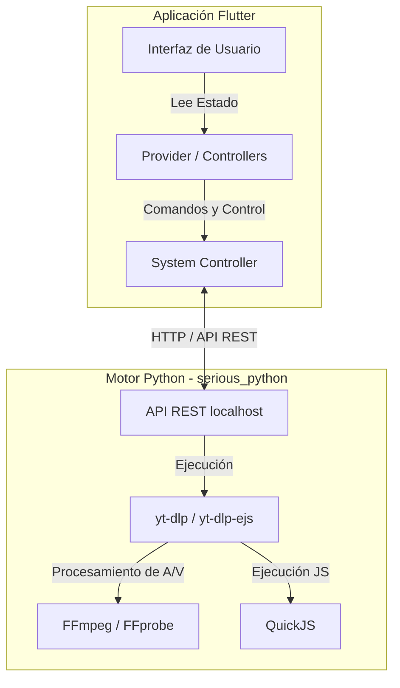

# Arquitectura del Sistema Vidra

Este documento describe la arquitectura global del sistema Vidra. En su versión 2, Vidra se reconstruyó desde cero para adoptar un modelo desacoplado donde la interfaz de usuario y la lógica de descarga pesada operan en procesos o capas distintas, garantizando un rendimiento óptimo y un mantenimiento más sencillo.

## Visión General

Vidra está compuesto principalmente por dos grandes bloques:

1. **Cliente Frontend (Flutter):** Gestiona la UI, configuración del usuario, localización, temas y actúa como orquestador del ciclo de vida del backend.
2. **Motor Backend (Python):** Se ejecuta en segundo plano como un servidor REST encapsulado dentro de un `Isolate`. Utiliza potentes herramientas de línea de comandos como `yt-dlp` y `ffmpeg` para procesar descargas.

```mermaid
graph TD
  subgraph Frontend [Aplicación Flutter]
    UI[Interfaz de Usuario]
    State[Provider / Controllers]
    SysCtrl[System Controller]
  end

  subgraph Backend [Motor Python - serious_python]
    Server[API REST localhost]
    YTDLP[yt-dlp / yt-dlp-ejs]
    FFMPEG[FFmpeg / FFprobe]
    QJS[QuickJS]
  end

  UI -->|Lee Estado| State
  State -->|Comandos y Control| SysCtrl
  SysCtrl <-->|HTTP / API REST| Server
  Server -->|Ejecución| YTDLP
  YTDLP -->|Procesamiento de A/V| FFMPEG
  YTDLP -->|Ejecución JS| QJS
```

## Arquitectura del Cliente Flutter (lib/)

La aplicación Flutter está estructurada siguiendo los principios de **Clean Architecture** para lograr una separación clara de responsabilidades. La inyección de dependencias y la gestión de estado se realiza a través de **Provider**.

La estructura de carpetas en `lib/` es la siguiente:

- `core/`: Configuración esencial, clientes de red, utilidades, temas e infraestructura (ej. `VidraHttpClient`).
- `features/`: Las funcionalidades de negocio organizadas por dominio. Cada feature incluye a su vez capas lógicas (`data/`, `presentation/`, `domain/`):
  - `downloads/`: Pantalla de descargas, encolamiento, y la ventana superpuesta (Overlay Isolate).
  - `locales/`: Internacionalización (i18n).
  - `settings/`: Preferencias del usuario.
  - `system/`: Integración del ciclo de vida de la aplicación y la inyección del backend en Python.
  - `updates/`: Comprobaciones de actualización y despliegues OTA (Over-The-Air).
- `shared/`: Componentes UI y utilidades genéricas reutilizables.

### Flujo de Estado (Provider)

El archivo `main.dart` configura una jerarquía de Providers que dictan cómo fluye la información:

1. **Capa 1 y 2 (Infraestructura Base):** `SystemController`, `GithubClient`, `VidraHttpClient`, `SettingsRepository`. Aquí el `VidraHttpClient` escucha dinámicamente al `SystemController` para obtener el puerto (usualmente `5000` pero dinámico) y el token de autenticación generados para el backend.
2. **Capa 3 (Repositorios):** Dependen de la red, como `DownloadRepository`.
3. **Capa 4 (Controladores de Estado):** Contienen la lógica de negocio consumida por la UI (ej. `DownloadsController`, `SettingsController`, `LocaleController`).

## Integración del Motor Backend (serious_python)

En lugar de requerir que el usuario instale Python, Vidra empaqueta su propio entorno de ejecución a través del paquete `serious_python`.

### Ciclo de vida del Motor

1. **Arranque (`SystemController`):** Cuando la app de Flutter arranca, el `SystemController` busca un puerto libre (Loopback IPv4) y genera un token seguro de 256 bytes.
2. **Lanzamiento del Isolate:** Se lanza un proceso en segundo plano (Dart Isolate) pasando el puerto, el token, y los directorios de trabajo.
3. **Desempaquetado (Unpacking):** El Isolate utiliza `serious_python` para extraer el código en Python (ubicado en `app/src`) hacia el almacenamiento local del dispositivo. Esto solo es costoso en el primer inicio.
4. **Ejecución del Servidor:** El servidor de Python arranca y queda a la escucha en el puerto asignado, esperando peticiones HTTP autenticadas con el token generado en el paso 1.

### Dependencias Nativas

El motor Python delega el trabajo pesado a dependencias escritas en C/C++ u otros lenguajes. Estas se incluyen precompiladas en el binario final (gracias al flujo CI/CD) o deben proveerse manualmente durante el desarrollo:

- **yt-dlp:** Extrae metadatos y resuelve enlaces de decenas de sitios web.
- **FFmpeg/FFprobe:** Encargados de mezclar (mux), convertir y analizar las pistas de audio y video descargadas.
- **QuickJS:** Un motor ligero de JavaScript utilizado para resolver desafíos de bot protection en ciertas plataformas.

## Seguridad y Aislamiento

- **Localhost Bound:** El servidor backend solo escucha en `127.0.0.1`. No es accesible desde otras máquinas en la misma red.
- **Autenticación con Token:** Todas las llamadas HTTP de Flutter al backend Python requieren el token dinámico en las cabeceras (Headers), previniendo que otras aplicaciones locales envíen comandos al motor de Vidra.
- **Aislamiento de Hilos (Isolates):** Las descargas de video son intensivas en CPU/I/O. Al ejecutar el motor en un Isolate y el backend en un hilo separado de C/Python, la interfaz de usuario en Flutter se mantiene fluida (60/120 fps) sin bloqueos.
